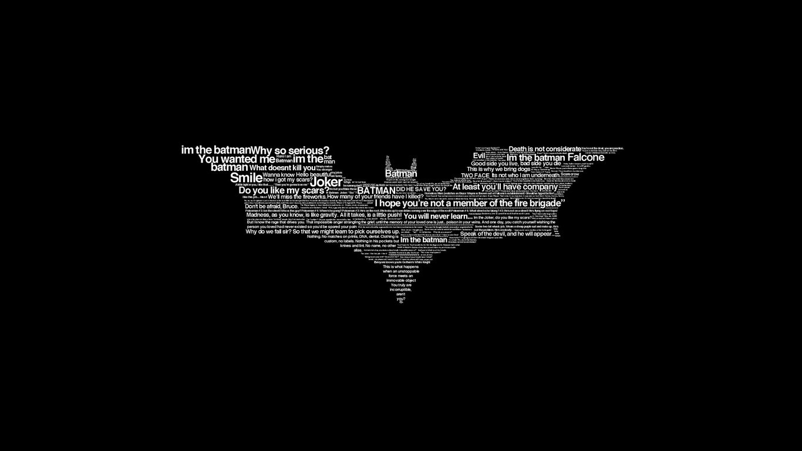

# Hi there 👋

    

I was born on July 29, 2001, I am a mathematics student from `Wuhan University of Technology`, and now I'm majoring in `information and computing science`.

How to contact me: (Here is my phone number and email address.)

&emsp; 

My pronouns: 

&emsp;&emsp;

## 🔧 Technologies & Tools

## &#x270d; Blog & Writing
&emsp;

💬 Ask me about
- `package development`
- `optimization method`
- `machine learning`
- `data analysis`

You can find my articles on [website](https://blog.csdn.net/linjing_zyq).

## &#x1f4c8; GitHub Stats

